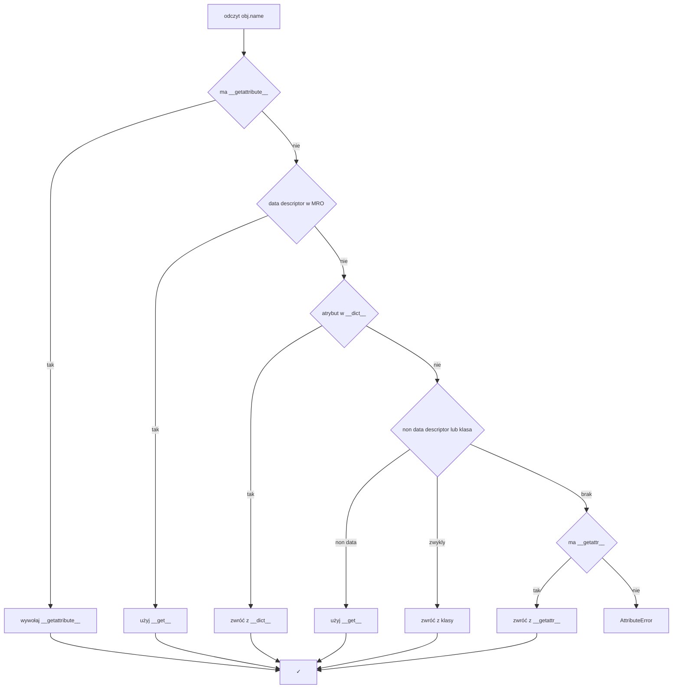

## **1. Attribute lookup**

- Python szuka atrybutu wg kolejności:
    
    1. obj.__dict__
        
    2. klasa obiektu (obj.__class__)
        
    3. MRO (Method Resolution Order) – klasy bazowe
        
    
- Jeśli znaleziony obiekt to **deskryptor**, aktywuje się jego protokół.
    

## **2. Descriptors**

- Obiekt zdefiniowany z metodami specjalnymi:
    
    - __get__(self, obj, type=None)
        
    - __set__(self, obj, value)
        
    - __delete__(self, obj)
        
    
- Typy:
    
    - **Data descriptor** (__get__ + __set__ lub __delete__) → wyższy priorytet niż obj.__dict__
        
    - **Non-data descriptor** (tylko __get__) → sprawdzany po obj.__dict__
        
    
- Przykłady wbudowane: property, staticmethod, classmethod, metody instancji.
    

  
## **3. Fallback**

- Jeśli lookup nie znalazł atrybutu:
    
    - wywoływane jest __getattr__(self, name)
        
    
- Jeśli __getattr__ nie istnieje → AttributeError
    
- Dodatkowo: __getattribute__ przechwytuje każde odwołanie (można implementować własny lookup).
    

  

## **4. Kolejność mechanizmów**

1. __getattribute__ (jeśli przeciążone, działa zawsze)
    
2. Szukanie w obj.__dict__
    
3. Szukanie w klasie i MRO
    
    - jeśli deskryptor → uruchamia protokół
        
    
4. Jeśli brak → __getattr__ (fallback)
    
5. Brak wszystkiego → AttributeError

# Attribute lookup → descriptors → fallback

**Priorytet**: data-descriptor → `obj.__dict__` → non-data-descriptor / atrybut klasy → `__getattr__` → `AttributeError`  
Data-descriptor = ma `__set__` lub `__delete__`. Non-data-descriptor = ma tylko `__get__`.

